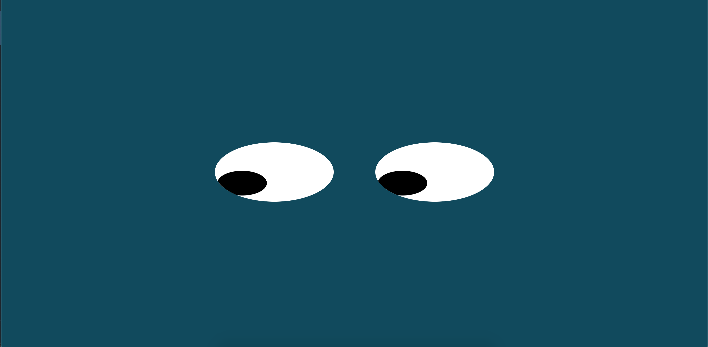

# Eyes
## Exercise on eyes

This is a website that tracks a users mouse with a pair of eyes. Made with HTML, JavaScript and CSS. I plan to make a version in the future that spawns eyeballs that bounce around the screen and follow the mouse.

<a href="https://vegan-morpheus.github.io/">My Portfolio</a>
